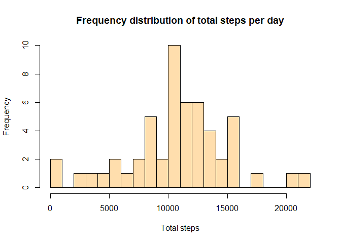
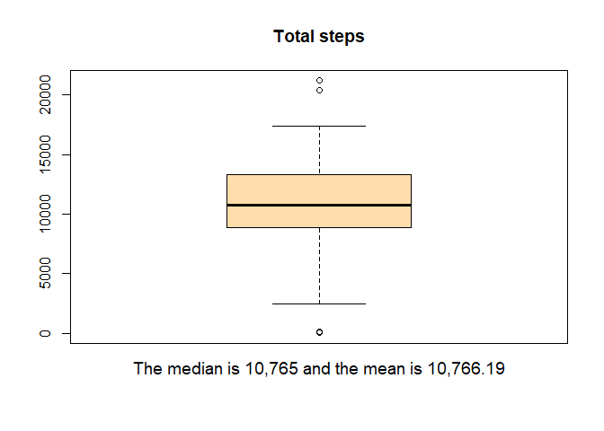
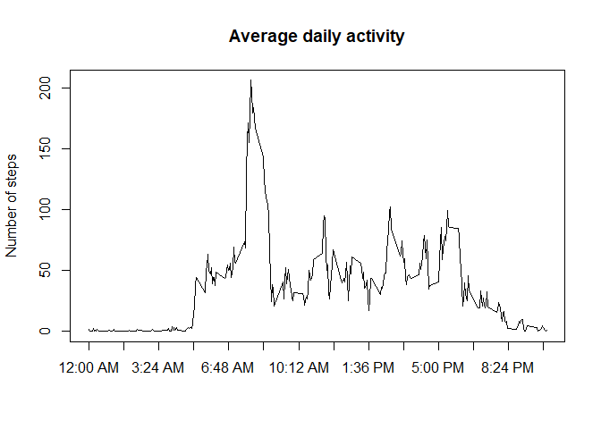
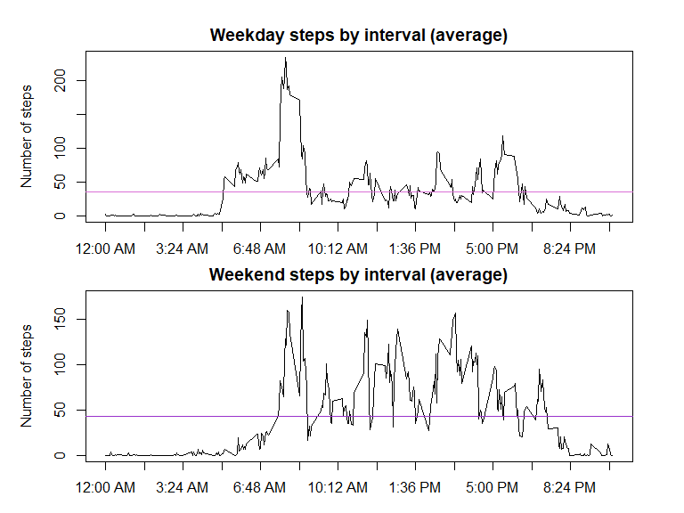

```r
library(dplyr)    # load the necessary packages
```
   
## **Loading and preprocessing the data**


```r
if (!exists("activity.csv")) {unzip("activity.zip")}      #if the file hasn't been unzipped before, unzip it
activity <- read.csv("activity.csv", colClasses = c(steps="numeric", date="Date", interval="numeric"))
```
## **What is mean total number of steps taken per day?**

```r
totalSteps <- activity %>% 
        group_by(date) %>% 
        filter(!is.na(steps)) %>% 
        summarize(total=sum(steps))
hist(totalSteps$total, 
     breaks = 16, 
     main = "Frequency distribution of total steps per day", 
     xlab = "Total steps",
     col="navajowhite")
```

<!-- -->

```r
meanSteps <- format(mean(totalSteps$total),  big.mark = ",", scientific=FALSE)
medianSteps <- format(median(totalSteps$total),  big.mark = ",", scientific=FALSE)
boxplot(totalSteps$total, 
        col="navajowhite", 
        main="Total steps")
mtext(paste("The median is", medianSteps, "and the mean is", meanSteps), cex=1.2, side = 1, line = 1)
```

<!-- -->

Above you can see a frequency distribution for total steps taken per day, excluding days where no data was available. Below the histogram is a boxplot showing the median, which in this situation is almost identical to the mean.  
  
Please note that these are based on the available data, and some days are missing due to having no steps measurements available.
<p>&nbsp;</p>


## **What is the average daily activity pattern?**


```r
avgIntervals <- activity %>% 
        group_by(interval) %>% 
        filter(!is.na(steps)) %>% 
        summarise(steps=mean(steps))
maxSteps <- format((avgIntervals$steps[which.max(avgIntervals$steps)]), digits=4)
maxStepsWhen <- (avgIntervals$interval[which.max(avgIntervals$steps)])
formattedLabels <- c("12:00 AM", "1:42 AM", "3:24 AM", "5:06 AM", "6:48 AM", "8:30 AM", "10:12 AM", 
                     "11:54 AM", "1:36 PM", "3:18 PM", "5:00 PM", "6:42 PM", "8:24 PM", "10:06 PM")
plot(x = avgIntervals$interval, 
     y = avgIntervals$steps, 
     type = "l", 
     main="Average daily activity", 
     xlab="", 
     ylab = "Number of steps", 
     xaxt="n")
axis(1, at=seq(0, 2400, by=180), labels = formattedLabels)
```

<!-- -->
<br>
835 is the interval with the maximum averaged number of steps (206.2).  
This corresponds to the interval from 8:35 to 8:40 AM.
<p>&nbsp;</p>

## **Imputing missing values**

```r
NAs <- which(rowSums(is.na(activity)) > 0)
totalNAs <- format(length(NAs), big.mark=",")        # figure out the number of rows with missing data
onlyNAs <- activity[NAs,] 
uniqueDays <- length(unique(onlyNAs$date))           # figure out the number of days with missing data
```
<p>&nbsp;</p>
The total number of rows with missing values is 2,304 over 8 days.
Since each day has a maximum of 288 5-minute intervals, and we have a total number of 2,304 
intervals over 8 days we know that the maximum number of intervals they could be missing 
is 288*8=2304 which matches our total.  
  
So, all of these 8 days are missing all of their intervals with no days 
missing partial step data in some intervals.  Based on this, I decided that the best way to impute missing values 
is to use the average values for each interval that we calculated above.
<p>&nbsp;</p>


```r
activityNoNAs <- activity

for (i in NAs){                                 # loop through the data and insert mean values instead of 
                                                # those that are missing
        interval <- activity$interval[i] 
        stepRow <- match(interval, avgIntervals$interval)
        activityNoNAs$steps[i] <- avgIntervals$steps[stepRow]
}

totalStepsNN <- activityNoNAs %>% group_by(date) %>% filter(!is.na(steps)) %>% summarize(total=sum(steps))
meanStepsNN <- format(mean(totalStepsNN$total),  big.mark = ",", scientific=FALSE)
medianStepsNN <- format(median(totalStepsNN$total),  big.mark = ",", scientific=FALSE)

hist(totalStepsNN$total, 
     breaks = 16, 
     main = "Frequency distribution of total steps per day with imputed values", 
     xlab = "Total steps",
     col="navajowhite")
```

<!-- -->

```r
boxplot(totalStepsNN$total, 
        col="navajowhite", 
        main="Total steps")
mtext(paste("The median with imputed values is", medianStepsNN, "but was", medianSteps,"."), 
      cex=1.2, 
      side = 1, 
      line = 1)
mtext(paste("The mean with imputed values is the same as it was", meanStepsNN), 
      cex=1.2, 
      side = 1, 
      line = 2)
```

<!-- -->

As you can see, imputing values did change the median and raised it a little bit, however, the mean remained the same because that the value we used for imputing.


## **Differences in activity between weekdays and weekends**


```r
activity <- activity %>%                                # add a column with days of the week
        mutate(dayOfWeek=weekdays(activity$date))

for (i in 1:nrow(activity)) {                           # change days to a factor of "weekday" or "weekend"
        if (activity$dayOfWeek[i] %in% c("Saturday", "Sunday")) {
            activity$dayOfWeek[i] <- "weekend"
        }
        else {
            activity$dayOfWeek[i] <- "weekday"
        }
}

activity$dayOfWeek <- as.factor(activity$dayOfWeek)

avgWeekdayIntervals <- activity %>%                     # find the average for weekdays
        filter(dayOfWeek == "weekday") %>% 
        group_by(interval) %>% 
        filter(!is.na(steps)) %>% 
        summarise(steps=mean(steps))
avgWeekdaySteps <- format(mean(avgWeekdayIntervals$steps), digits=4)

avgWeekendIntervals <- activity %>%                     # find the average for weekdays
        filter(dayOfWeek == "weekend") %>% 
        group_by(interval) %>% 
        filter(!is.na(steps)) %>% 
        summarise(steps=mean(steps))
avgWeekendSteps <- format(mean(avgWeekendIntervals$steps), digits=4)

# set up parameters to create 2 graphs in 1 window and have margins large enough to see labels
par(mfrow=c(2,1), oma=c(1,1,1,1), mar=c(2,4,2,2))
plot(avgWeekdayIntervals$interval, 
     avgWeekdayIntervals$steps,
     type="l",
     main="Weekday steps by interval (average)", 
     cex=1,
     xlab="", 
     ylab = "Number of steps", 
     xaxt="n")
axis(1, at=seq(0, 2400, by=180), labels = formattedLabels)
abline(h=avgWeekdaySteps, col="orchid")                       # add a line for the average for weekdays

plot(avgWeekendIntervals$interval, 
     avgWeekendIntervals$steps,
     type="l",
     main="Weekend steps by interval (average)", 
     cex=1,
     xlab="", 
     ylab = "Number of steps", 
     xaxt="n")
axis(1, at=seq(0, 2400, by=180), labels = formattedLabels)
abline(h=avgWeekendSteps, col="darkorchid")                    # add a line for the average for weekends
```

<!-- -->

As you can see, breaking the data up into weekdays and weekends does affect the results. On weekdays 
the pattern looks different from the weekend. The average number of steps on weekdays is 35.34 
and most activity happens in the mornings, while on weekends the average number of steps is higher at 
43.08 and is more spread out throughout the day.
